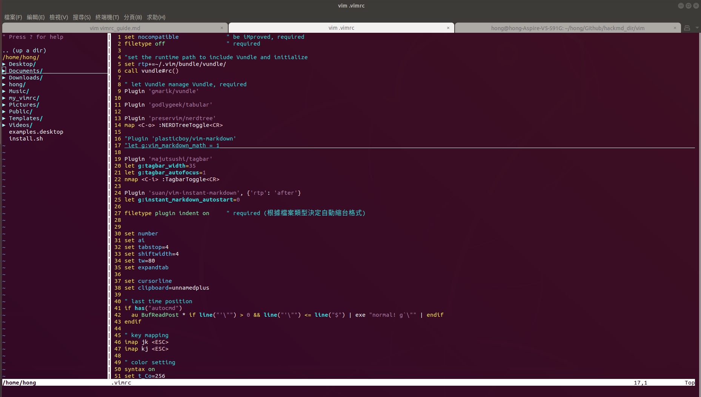
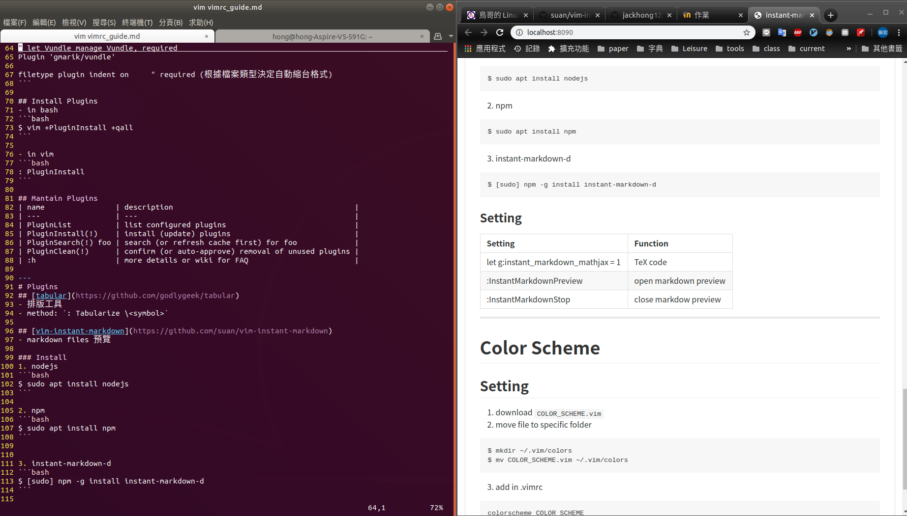

This repository is used to store my setting files of the vim. The configuration of the file ".vimrc-lite" only contains the basic features supported by vim. In the file ".vimrc", I use [vundle](https://github.com/VundleVim/Vundle.vim) to manage the other plugins.


## Installation
```
$ git clone https://github.com/jackhong12/my_vimrc.git ~/my_vimrc
$ sudo sh ~/my_vimrc/start.sh
```

## Files in This Repository
```
./
├── color           color scheme
├── config          configuration files for plugins
├── img
├── manual
│   ├── basic       some notes for using basic features in vim
│   └── plugins     some notes for using plugins
└── README.md
```

## Plugins Used in .vimrc
- [godlygeek/tabular](https://github.com/godlygeek/tabular)
    - To align table automatically
- [preservim/nerdtree](https://github.com/preservim/nerdtree)
    - To browse the directories and open files more easily
    
- [majutsushi/tagbar](https://github.com/majutsushi/tagbar)
    - To display all functions and variables
    
- [suan/vim-instant-markdown](https://github.com/suan/vim-instant-markdown)
    - To open a markdown in the browser
    
- [airblade/vim-gitgutter](https://github.com/airblade/vim-gitgutter)
    - To show a git diff in the sign column
- [plasticboy/vim-markdown](https://github.com/plasticboy/vim-markdown)
- [Yggdroot/indentLine](https://github.com/Yggdroot/indentLine)
- [vim-airline/vim-airline](https://github.com/vim-airline/vim-airline) & [vim-airline/vim-airline-themes](https://github.com/vim-airline/vim-airline-themes)
- [ycm-core/YouCompleteMe](https://github.com/ycm-core/YouCompleteMe)
    - autocomplete
    - `cmake -DCMAKE_EXPORT_COMPILE_COMMANDS=1 -DCMAKE_BUILD_TYPE=Debug`: create compile_commands.json file
- [ryanoasis/vim-devicons](https://github.com/ryanoasis/vim-devicons)
    - Add fancy symbols in vim
- [google/vim-searchindex](https://github.com/google/vim-searchindex)
    - Show the index of the searching word.
    - `g/`: Show previous searching words

## Installing or Updating Plugins by vundle
**in vim**
| name                | description                                         |
| ---                 | ---                                                 |
| PluginList          | list configured plugins                             |
| PluginInstall(!)    | install (update) plugins                            |
| PluginSearch(!) foo | search (or refresh cache first) for foo             |
| PluginClean(!)      | confirm (or auto-approve) removal of unused plugins |
| :h                  | more details or wiki for FAQ                        |
